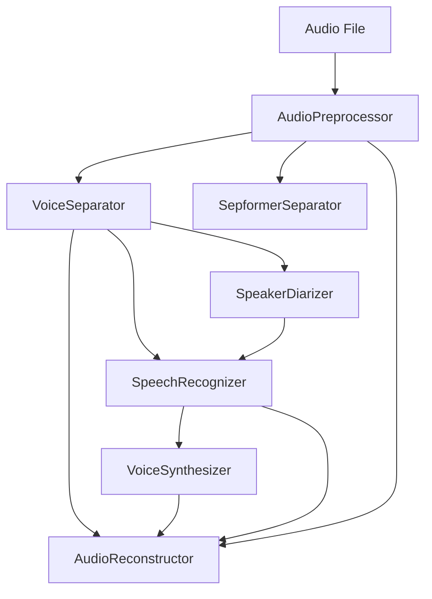

# Hyper Audio

## 🎯 Project Goals

This project aims to create a complete AI-powered audio processing pipeline that can transform podcasts by replacing speaker voices while maintaining natural timing, cadence, and conversation flow. All processing is done locally using open-source AI models optimized for NVIDIA RTX 4090.

### Core Objectives

1. **Voice Isolation & Separation**: Extract clean speech from podcasts with background music/noise
2. **Speaker Diarization**: Identify and separate different speakers in multi-person conversations  
3. **Speech Recognition**: Transcribe speech with speaker attribution and timing
4. **Voice Replacement**: Replace target speaker(s) with AI-generated voice while preserving:
   - Original timing and pacing
   - Natural speech patterns and inflection
   - Conversation flow and overlaps
5. **Audio Reconstruction**: Seamlessly blend replaced voice with original audio

### Technical Requirements

- **Hardware**: NVIDIA RTX 4090 (24GB VRAM)
- **Software**: All models run locally using open-source AI
- **Performance**: Real-time or near real-time processing for typical podcast lengths
- **Quality**: Broadcast-quality output indistinguishable from original

## 📋 Development Phases & TODO List

### Phase 1: Foundation & Research ⚙️
**Status**: ✅ Completed

#### ✅ Completed
- [x] Project structure and dependency management
- [x] Configuration system with environment variables
- [x] Logging and audio utility frameworks
- [x] Basic virtual environment setup
- [x] **Pipeline Orchestration**: Complete resilient pipeline with error handling and recovery
- [x] **Memory Management**: GPU memory optimization and cleanup utilities
- [x] **Checkpoint System**: Full state management and recovery capabilities
- [x] **Analytics Engine**: Comprehensive monitoring and performance tracking
- [x] **Test Suite**: Complete test coverage for pipeline infrastructure
- [x] **🆕 Enhanced Pipeline Architecture**: Configurable, type-safe pipeline with dependency validation
- [x] **🆕 Multi-Stage Audio Processing**: Support for complex processing chains (music separation + speech enhancement)
- [x] **🆕 Stage Interface System**: Strongly-typed stage inputs/outputs with automatic compatibility checking
- [x] **🆕 Intelligent Development Playground**: Auto-dependency resolution with user guidance and smart caching
- [x] **🆕 Complete Stage Implementation**: All 9 pipeline stages updated to new configurable interface

#### 🔍 Research Required
- [ ] **Voice Cloning Models**: Research latest open-source TTS models that support voice cloning
  - Evaluate: MetaVoice-1B, Tortoise-TTS, Bark, Coqui TTS
  - **Requirements needed**: Voice quality benchmarks, inference speed, VRAM usage
- [ ] **Speaker Diarization**: Compare pyannote.audio vs alternatives (SpeakerBox, resemblyzer)
  - **Requirements needed**: Accuracy metrics for multi-speaker scenarios
- [ ] **Vocal Separation**: Evaluate Demucs alternatives (Spleeter, OpenUnmix)
  - **Requirements needed**: Quality metrics for speech vs music separation

### Phase 2: Core Audio Processing 🎵
**Status**: 🟡 In Progress - Pipeline Integration Needed

#### ✅ Standalone Scripts Available
- [x] **Vocal Separation**: `remove_music.py` - HTDemucs implementation
- [x] **Speaker Diarization**: `transcribe.py` - pyannote.audio integration
- [x] **Speech Recognition**: `transcribe.py` - Whisper integration

#### ✅ Integration Completed  
- [x] **EnhancedPipelineStage Interface**: Abstract base class with type-safe inputs/outputs
- [x] **Audio Preprocessing Stage**: Multi-format support, normalization, sample rate conversion
- [x] **Voice Separator Stages**: HTDemucs integration with multiple model options
- [x] **Speaker Diarizer Stage**: Speaker identification and timing extraction
- [x] **Speech Recognizer Stage**: Whisper integration with speaker attribution
- [x] **Voice Synthesizer Stage**: TTS integration for voice replacement
- [x] **Audio Reconstructor Stage**: Final audio mixing and reconstruction
- [x] **Advanced Separators**: SepformerSeparator and EnhancedVoiceSeparator variants

#### 🔍 Research Required
- [ ] **Audio Quality Metrics**: Define objective measures for separation quality
- [ ] **Edge Case Handling**: Research solutions for overlapping speech, background noise
- [ ] **Performance Optimization**: CUDA optimization for audio processing pipelines

### Phase 3: Speech Recognition & Analysis 🎤
**Status**: 🔴 Not Started

#### Implementation Tasks
- [ ] **Whisper Integration**
  - [ ] Local Whisper model deployment (large-v2/v3)
  - [ ] Batch processing for long audio segments
  - [ ] Speaker-attributed transcription alignment
- [ ] **Speech Analysis**
  - [ ] Prosody and timing analysis
  - [ ] Speaking pattern extraction
  - [ ] Emotion/tone detection for voice matching

#### 🔍 Research Required
- [ ] **Whisper Alternatives**: Evaluate faster local ASR models (wav2vec2, SpeechT5)
- [ ] **Timing Precision**: Research methods for sub-word timing alignment
- [ ] **Voice Characteristics**: Define measurable voice attributes for matching

#### 🏗️ Architecture Design Needed
- [ ] **Transcription Pipeline**: Design efficient batching and memory management
- [ ] **Data Structures**: Define schemas for annotated audio segments

### Phase 4: Voice Synthesis & Cloning 🗣️
**Status**: 🟡 In Progress - Pipeline Integration Needed

#### ✅ Standalone Scripts Available
- [x] **Voice Synthesis**: `tts.py` - MetaVoice-1B implementation

#### 🔄 Integration Tasks (High Priority)
- [ ] **Voice Synthesizer Stage**: Integrate `tts.py` into pipeline
  - [ ] Adapt MetaVoice-1B code to stage interface
  - [ ] Add synthesized audio checkpoint format
- [ ] **Voice Matching System**
  - [ ] Source voice analysis and characterization
  - [ ] Target voice parameter adjustment
  - [ ] Quality validation and similarity scoring

#### 🔍 Research Required  
- [ ] **Voice Cloning Quality**: Benchmark different models for naturalness and similarity
  - **Requirements needed**: Subjective quality metrics, A/B testing framework
- [ ] **Few-Shot Learning**: Research minimum sample requirements for voice cloning
- [ ] **Real-time Synthesis**: Evaluate streaming TTS for interactive applications

#### 🏗️ Architecture Design Needed
- [ ] **Model Pipeline**: Design efficient loading/switching between voice models
- [ ] **Quality Control**: Automated quality assessment for synthetic speech

### Phase 5: Audio Reconstruction & Mixing 🎛️
**Status**: 🔴 Not Started - Needs Implementation

#### 🔄 Integration Tasks (High Priority)
- [ ] **Audio Reconstructor Stage**: Implement final pipeline stage
  - [ ] Timing preservation and alignment
  - [ ] Dynamic time warping for speech alignment
  - [ ] Pause and breath timing preservation
  - [ ] Natural speech pacing reconstruction
- [ ] **Audio Blending**
  - [ ] Seamless crossfading between original and synthetic audio
  - [ ] Background audio reintegration
  - [ ] Final mastering and quality enhancement

#### 🔍 Research Required
- [ ] **Audio Alignment**: Research best practices for speech timing alignment
- [ ] **Quality Enhancement**: Post-processing techniques for synthetic speech
- [ ] **Perceptual Quality**: Metrics for human-perceived audio quality

#### 🏗️ Architecture Design Needed
- [ ] **Real-time Processing**: Design for streaming audio reconstruction
- [ ] **Quality Pipeline**: Automated quality control and validation

### Phase 6: Integration & Optimization 🚀
**Status**: 🔴 Not Started

#### Implementation Tasks
- [ ] **End-to-End Pipeline**
  - [ ] Complete workflow orchestration
  - [ ] Error handling and recovery mechanisms
  - [ ] Progress tracking and user feedback
- [ ] **Performance Optimization**
  - [ ] GPU memory optimization for RTX 4090
  - [ ] Model quantization and optimization
  - [ ] Parallel processing where possible
- [ ] **User Interface**
  - [ ] Command-line interface with progress bars
  - [ ] Configuration file support
  - [ ] Batch processing capabilities

#### 🏗️ Architecture Design Needed
- [ ] **System Integration**: Define interfaces between all pipeline components
- [ ] **Resource Management**: Optimize for single GPU deployment
- [ ] **User Experience**: Design intuitive workflow for non-technical users

### Phase 7: Testing & Validation 🧪
**Status**: 🔴 Not Started

#### Implementation Tasks
- [ ] **Quality Assurance**
  - [ ] Automated testing suite for each component
  - [ ] Integration tests for complete pipeline
  - [ ] Performance benchmarking on standard datasets
- [ ] **User Testing**
  - [ ] Beta testing with real podcast content
  - [ ] Quality assessment by human evaluators
  - [ ] Edge case testing and bug fixes

#### 🔍 Research Required
- [ ] **Evaluation Metrics**: Define comprehensive quality metrics for voice replacement
- [ ] **Benchmark Datasets**: Identify or create standard test datasets
- [ ] **Success Criteria**: Define measurable goals for project completion

## 🛠️ Technical Stack

### Core AI Models (Local/Open Source)
- **Speech Recognition**: OpenAI Whisper (large-v2/v3)
- **Speaker Diarization**: pyannote.audio
- **Vocal Separation**: Meta Demucs
- **Voice Synthesis**: MetaVoice-1B / Tortoise-TTS / Bark
- **Speech Processing**: SpeechBrain ecosystem

### Infrastructure
- **GPU**: NVIDIA RTX 4090 (24GB VRAM)
- **Framework**: PyTorch with CUDA optimization
- **Audio**: librosa, soundfile, pydub
- **ML Pipeline**: HuggingFace Transformers

## 📊 Success Metrics

### Technical Metrics
- **Processing Speed**: < 2x real-time for typical podcast length
- **Voice Quality**: > 4.0/5.0 subjective quality score
- **Speaker Accuracy**: > 95% diarization accuracy
- **Timing Preservation**: < 50ms deviation from original timing

### User Experience Metrics
- **Ease of Use**: Single command processing
- **Reliability**: < 5% failure rate on diverse content
- **Resource Efficiency**: < 20GB VRAM peak usage

## 🚧 Current Development Focus

**🔥 CURRENT DEVELOPMENT STATUS:**
✅ **Pipeline Infrastructure: COMPLETE** - All 9 stages implemented with enhanced interface
✅ **Dependency Resolution: COMPLETE** - Intelligent auto-resolution and user guidance
✅ **Development Tools: COMPLETE** - Enhanced playground with smart caching and analysis

**🎯 IMMEDIATE NEXT STEPS (High Priority):**
1. **AI Model Integration** - Install and test remaining AI models:
   - SpeechBrain models for enhanced separation  
   - PyAnnote models for speaker diarization
   - Advanced Whisper models for transcription
2. **End-to-End Pipeline Testing** - Complete voice replacement workflows
3. **Performance Optimization** - GPU memory management and speed improvements
4. **Quality Metrics** - Objective measures for voice replacement quality

**Pipeline Infrastructure Status: ✅ COMPLETE**
- Resilient pipeline orchestration with checkpointing
- State management and recovery
- Analytics and monitoring
- Comprehensive test coverage

**Areas Needing Requirements:**
- Voice quality benchmarking methodology
- User interface design specifications
- Performance optimization targets

**Research Questions:**
- Best open-source voice cloning for real-time use?
- Optimal model quantization strategies for RTX 4090?
- Edge case handling for complex audio scenarios?

## 🛠️ Development Tools

### Enhanced Pipeline Development Playground

The enhanced development playground (`dev_playground_enhanced.py`) provides intelligent dependency resolution and user-guided pipeline development with the new configurable stage interface.

#### 🆕 Key Features

- **🧠 Intelligent Dependency Resolution**: Automatically detects missing inputs and suggests prerequisite stages
- **🔄 Auto-Execution Chains**: Runs dependency stages automatically in correct order
- **📊 Real-time Analysis**: Shows what data is available vs. what each stage needs
- **💾 Smart Caching**: Reuses results from previous runs to speed up development
- **🎯 Interactive Guidance**: Provides user menus when multiple options are available
- **📋 Comprehensive Stage Metadata**: Shows inputs, outputs, and capabilities for all stages

#### Quick Start

```bash
# Install dependencies and prepare environment
pip install -e .

# List all available stages with their capabilities
python dev_playground_enhanced.py list

# Analyze dependencies for any stage
python dev_playground_enhanced.py analyze --stage SpeechRecognizer

# Automatically resolve and run dependency chain
python dev_playground_enhanced.py auto --stage VoiceSeparator

# Run with interactive dependency resolution
python dev_playground_enhanced.py run --stage SpeechRecognizer --interactive
```

#### Available Commands

| Command | Description | Example |
|---------|-------------|---------|
| `list` | Show all stages with inputs/outputs | `python dev_playground_enhanced.py list` |
| `analyze` | Analyze dependencies for a stage | `python dev_playground_enhanced.py analyze --stage VoiceSeparator` |
| `run` | Run a specific stage | `python dev_playground_enhanced.py run --stage AudioPreprocessor` |
| `auto` | Auto-resolve and run dependency chain | `python dev_playground_enhanced.py auto --stage SpeakerDiarizer` |
| `deps` | Show suggested execution path | `python dev_playground_enhanced.py deps --stage SpeechRecognizer` |

#### Command Options

- `--stage` / `-s`: Specify which stage to operate on
- `--interactive` / `-i`: Enable interactive dependency resolution with user menus
- `--config` / `-c`: Pass JSON configuration to the stage
- `--data-dir` / `-d`: Specify data directory (default: `data`)
- `--no-cache`: Don't cache results from this run

#### Development Workflow Examples

##### 🚀 Getting Started (First Time)

```bash
# 1. Set up sample data
mkdir -p data
# Place your audio files in data/ directory (WAV, MP3, FLAC supported)

# 2. See what stages are available
python dev_playground_enhanced.py list

# 3. Start with the simplest stage (only needs audio files)
python dev_playground_enhanced.py run --stage AudioPreprocessor

# 4. Use auto mode to run complex pipelines automatically  
python dev_playground_enhanced.py auto --stage VoiceSeparator
```

##### 🔍 Understanding Dependencies

```bash
# Check what a stage needs before running
python dev_playground_enhanced.py analyze --stage SpeechRecognizer

# Output shows:
# ✅ Satisfied inputs: (none)
# ❌ Missing inputs: 
#    🔴 vocals (audio_mono): Separated vocal audio
#    🔴 sample_rate (sample_rate): Audio sample rate  
#    🔴 speaker_segments (speaker_segments): Speaker diarization results
# 💡 Suggested stages: AudioPreprocessor, VoiceSeparator, SpeakerDiarizer

# See the execution order needed
python dev_playground_enhanced.py deps --stage SpeechRecognizer
# Output: AudioPreprocessor → VoiceSeparator → SpeakerDiarizer → SpeechRecognizer
```

##### ⚡ Rapid Development Iteration

```bash
# Run the full dependency chain automatically
python dev_playground_enhanced.py auto --stage SpeakerDiarizer

# After making code changes to SpeakerDiarizer, test just that stage
python dev_playground_enhanced.py run --stage SpeakerDiarizer
# (Uses cached inputs from previous runs automatically)

# Test with custom configuration  
python dev_playground_enhanced.py run --stage VoiceSeparator \
  --config '{"model_name": "htdemucs_6s", "normalize": false}'
```

##### 🎯 Interactive Development

```bash
# Use interactive mode for guided development
python dev_playground_enhanced.py run --stage SpeechRecognizer --interactive

# Interactive output guides you through dependencies:
# 🔍 Analyzing dependencies for SpeechRecognizer...
# ❌ Missing: vocals (audio_mono)
#    🏭 Can be produced by: VoiceSeparator, EnhancedVoiceSeparator
#    ▶️  Multiple options available:
#       1. VoiceSeparator (✅ Ready)
#       2. EnhancedVoiceSeparator (✅ Ready)  
#    ▶️  Select stage to run (1-2): _
```

##### 📊 Performance Analysis

```bash
# Analyze what data is available vs what each stage needs
python dev_playground_enhanced.py analyze --stage AudioReconstructor

# Monitor cache usage and data flow
ls -la dev_cache/
# Shows: audiopreprocessor_*, voiceseparator_*, speakerdiarizer_* etc.

# Each cached result includes:
# - data.pkl (actual results)
# - metadata.json (stage info, outputs, timing)  
# - *.wav files (audio outputs for listening)
```

#### Cached Results

The playground stores intermediate results in `dev_cache/` with automatic naming:
- `preprocessor_<timestamp>.pkl` - Normalized audio data
- `separator_<timestamp>.pkl` - Separated audio components  
- `diarizer_<timestamp>.pkl` - Speaker segments
- `recognizer_<timestamp>.pkl` - Transcription with timing
- `synthesizer_<timestamp>.pkl` - Generated speech
- `reconstructor_<timestamp>.pkl` - Final mixed audio

This allows rapid iteration on individual stages without re-running the entire pipeline.

### 🎭 Pipeline Stage Reference

The enhanced playground automatically detects and uses the new configurable stage interface. Each stage declares its inputs and outputs with type safety and dependency validation.

#### 📦 Available Stages

| Stage | Category | Purpose | Model |
|-------|----------|---------|-------|
| **AudioPreprocessor** | preprocessing | Load, normalize and prepare audio | - |
| **VoiceSeparator** | separation | Separate vocals from music | htdemucs_ft |
| **EnhancedVoiceSeparator** | separation | Enhanced vocal separation | htdemucs_ft | 
| **SpeechEnhancer** | enhancement | Reduce noise, enhance speech | speechbrain/sepformer-whamr |
| **SpeakerDiarizer** | analysis | Identify speakers and timing | pyannote |
| **SpeechRecognizer** | recognition | Transcribe speech with speakers | whisper-base |
| **VoiceSynthesizer** | synthesis | Generate replacement voice | tacotron2 |
| **AudioReconstructor** | reconstruction | Combine synthesized voice with music | - |
| **SepformerSeparator** | separation | Advanced source separation | speechbrain/sepformer-whamr |

#### 🔄 Data Flow & Dependencies



#### 📋 Stage Input/Output Details

##### 1. AudioPreprocessor
```bash
# Auto-detects audio files in data/ directory
python dev_playground_enhanced.py run --stage AudioPreprocessor
```
- **📥 Input**: `file_path` (string) - Path to audio file
- **📤 Outputs**: 
  - `audio_with_sr`: (audio_array, sample_rate) tuple
  - `audio_mono`: Mono audio array  
  - `sample_rate`: Integer sample rate

##### 2. VoiceSeparator  
```bash
# Uses cached AudioPreprocessor output automatically
python dev_playground_enhanced.py run --stage VoiceSeparator
```
- **📥 Input**: `audio_with_sr` from AudioPreprocessor
- **📤 Outputs**:
  - `vocals`: Separated vocal audio
  - `music`: Separated instrumental audio
  - `separated_audio`: Dict with both vocals and music

##### 3. SpeakerDiarizer
```bash
# Auto-finds vocals and sample_rate from previous stages
python dev_playground_enhanced.py run --stage SpeakerDiarizer
```
- **📥 Inputs**: 
  - `vocals` (audio_mono): Separated vocal audio
  - `sample_rate`: Audio sample rate
- **📤 Output**: `speaker_segments` - List of speaker timing segments

##### 4. SpeechRecognizer
```bash
# Needs vocals, sample_rate, and speaker_segments
python dev_playground_enhanced.py run --stage SpeechRecognizer
```
- **📥 Inputs**:
  - `vocals` (audio_mono): Separated vocal audio  
  - `sample_rate`: Audio sample rate
  - `speaker_segments`: Speaker diarization results
- **📤 Output**: `transcription` - Full transcription with speaker attribution

##### 5. VoiceSynthesizer
```bash
# Uses transcription and sample_rate from previous stages
python dev_playground_enhanced.py run --stage VoiceSynthesizer
```
- **📥 Inputs**:
  - `transcription`: Speech recognition results
  - `sample_rate`: Audio sample rate
- **📤 Output**: `synthesized_audio` - Generated voice for target speaker

##### 6. AudioReconstructor
```bash
# Automatically gathers all required inputs from cache
python dev_playground_enhanced.py run --stage AudioReconstructor
```
- **📥 Inputs**:
  - `separated_audio`: Original vocals and music
  - `synthesized_audio`: New synthesized voice
  - `transcription`: Timing information
  - `sample_rate`: Audio sample rate
- **📤 Output**: `final_audio` - Complete reconstructed audio

#### 🚀 Advanced Usage Examples

##### Full Pipeline Chain
```bash
# Run complete pipeline from start to finish
python dev_playground_enhanced.py auto --stage AudioReconstructor

# This automatically runs:
# 1. AudioPreprocessor (loads/normalizes audio)
# 2. VoiceSeparator (separates vocals from music)  
# 3. SpeakerDiarizer (identifies speakers)
# 4. SpeechRecognizer (transcribes speech)
# 5. VoiceSynthesizer (generates new voice)
# 6. AudioReconstructor (combines everything)
```

##### Custom Configuration
```bash
# Configure individual stages
python dev_playground_enhanced.py run --stage VoiceSeparator \
  --config '{"model_name": "htdemucs_6s", "normalize": false}'

python dev_playground_enhanced.py run --stage SpeechRecognizer \
  --config '{"model_size": "large", "language": "en"}'
```

##### Development & Testing
```bash
# Compare different separation models
python dev_playground_enhanced.py run --stage VoiceSeparator --config '{"model_name": "htdemucs_ft"}'
python dev_playground_enhanced.py run --stage EnhancedVoiceSeparator  
python dev_playground_enhanced.py run --stage SepformerSeparator

# Test with different data directories
python dev_playground_enhanced.py run --stage AudioPreprocessor --data-dir test_samples/

# Run without caching for testing
python dev_playground_enhanced.py run --stage SpeakerDiarizer --no-cache
```

##### Data Management
```bash
# Check current cache contents
ls -la dev_cache/

# View cached result metadata
cat dev_cache/voiceseparator_*/metadata.json

# Listen to separated audio
play dev_cache/voiceseparator_*/vocals.wav
play dev_cache/voiceseparator_*/music.wav

# Clean up old cache
rm -rf dev_cache/audiopreprocessor_*
```

#### 🔧 Troubleshooting

##### Common Issues

**"Could not resolve required input"**
```bash
# Check what data is available
python dev_playground_enhanced.py analyze --stage YourStage

# Run prerequisite stages first
python dev_playground_enhanced.py auto --stage YourStage
```

**"ModuleNotFoundError: No module named '...'"**
```bash
# Install missing AI model dependencies
pip install "demucs>=4.0.0"  # For voice separation
pip install "speechbrain>=0.5.0"  # For advanced separation

# Or install all optional dependencies
pip install -e ".[ai-models]"
```

**Stage fails with CUDA out of memory**
```bash
# Use smaller models or reduce batch size
python dev_playground_enhanced.py run --stage VoiceSeparator \
  --config '{"device": "cpu"}' 

# Clear GPU cache
python -c "import torch; torch.cuda.empty_cache()"
```

**Interactive mode gets stuck**
```bash
# Use auto mode instead for non-interactive environments
python dev_playground_enhanced.py auto --stage StageName

# Or run dependencies manually
python dev_playground_enhanced.py deps --stage StageName
```

##### Performance Tips

- **Cache Management**: Keep frequently used results, clean old cache periodically
- **GPU Memory**: Use `auto` mode to run stages sequentially and free memory between stages  
- **Development Speed**: Use `--no-cache` when testing code changes to avoid stale results
- **Model Loading**: First run downloads models - subsequent runs are much faster

##### Sample Data Setup

```bash
# Recommended data directory structure
data/
├── test_short.wav          # 30-60 second clips for rapid testing
├── podcast_sample.wav      # 2-5 minute samples for full testing
├── conversation.wav        # Multi-speaker content  
└── music_with_voice.mp3    # Content with background music
```

The enhanced playground provides intelligent guidance for any issues - use `analyze` command to understand what each stage needs!

## 🤝 Contributing

This is an experimental project exploring the boundaries of local AI audio processing. Areas particularly needing research and development are marked with 🔍 and 🏗️ above.

## 📄 License

MIT License - See LICENSE file for details


  1. Asteroid Models (SpeechBrain ecosystem)

  "speechbrain/sepformer-wham"           # Speech + noise + reverb
  "speechbrain/sepformer-whamr"          # + room acoustics
  "speechbrain/sepformer-wsj02mix"       # Multi-speaker + noise
  "speechbrain/dualpath-rnn-wsj0-2mix"   # Classic multi-source

  2. ONNX Speech Enhancement Models

  "microsoft/speechtokenizer-base"        # Microsoft's multi-domain
  "nvidia/speechtokenizer"               # NVIDIA's approach

  3. Universal Source Separation

  "asteroid/ConvTasNet_WHAM"             # 3-source: speech + 2 noise types
  "asteroid/DPRNNTasNet_WHAMR"           # + reverberation handling
  "facebook/bandit-v1_0"                 # Facebook's universal separator

  4. Research Models (Cutting Edge)

  "speechbrain/resepformer-wsj02mix"     # Recent state-of-the-art
  "kaituoxu/Conv-TasNet"                 # Lightweight option
  "asteroid/DPRNN_TAC"                   # Time-domain separation

  5. Commercial-Grade Options

  "crisp/speech-enhancement"             # Multi-modal enhancement
  "elevenlabs/speech-isolator"           # If available

  🏆 Top Recommendations

  1. speechbrain/sepformer-whamr - Best all-around for speech + music + noise + reverb
  2. asteroid/DPRNNTasNet_WHAMR - Good performance/speed balance
  3. facebook/bandit-v1_0 - If you can access it (universal separator)