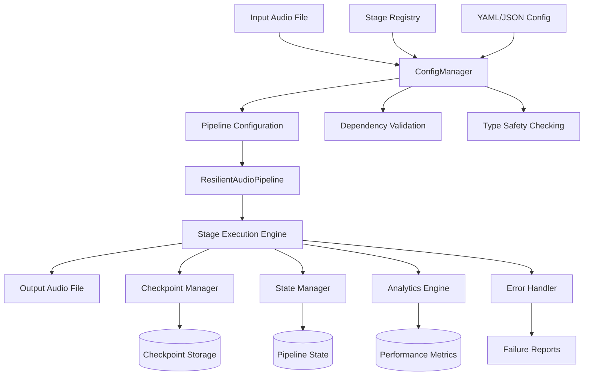
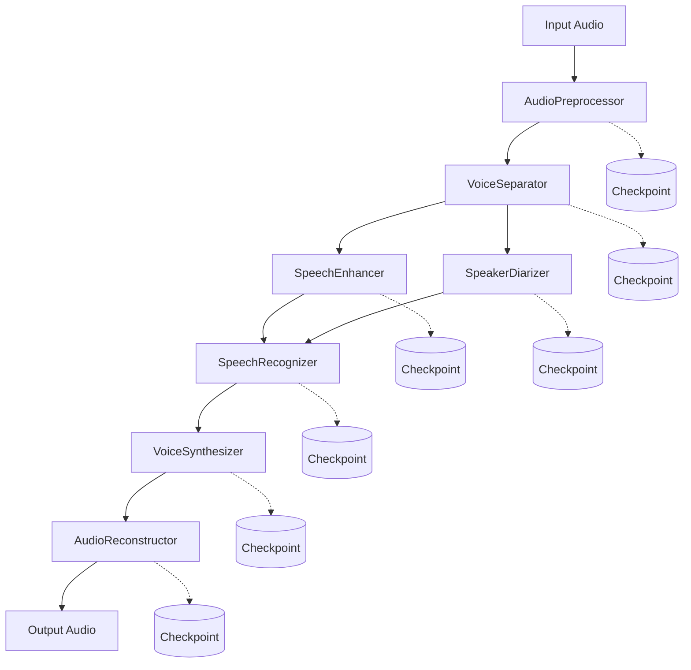
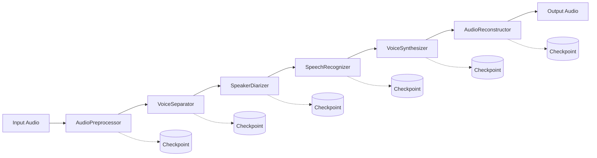
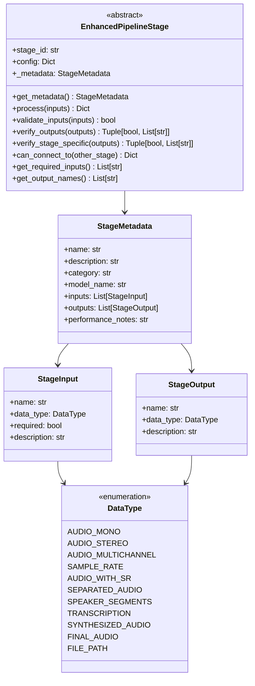
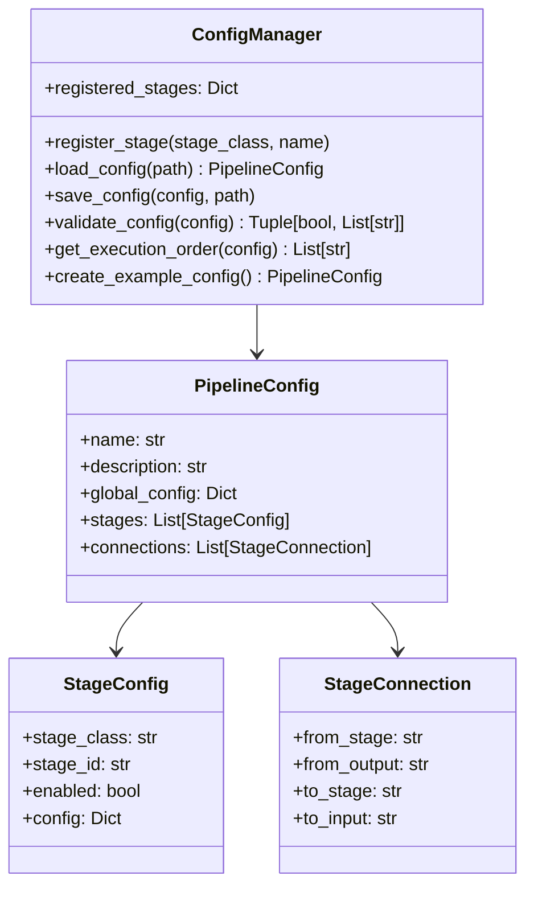
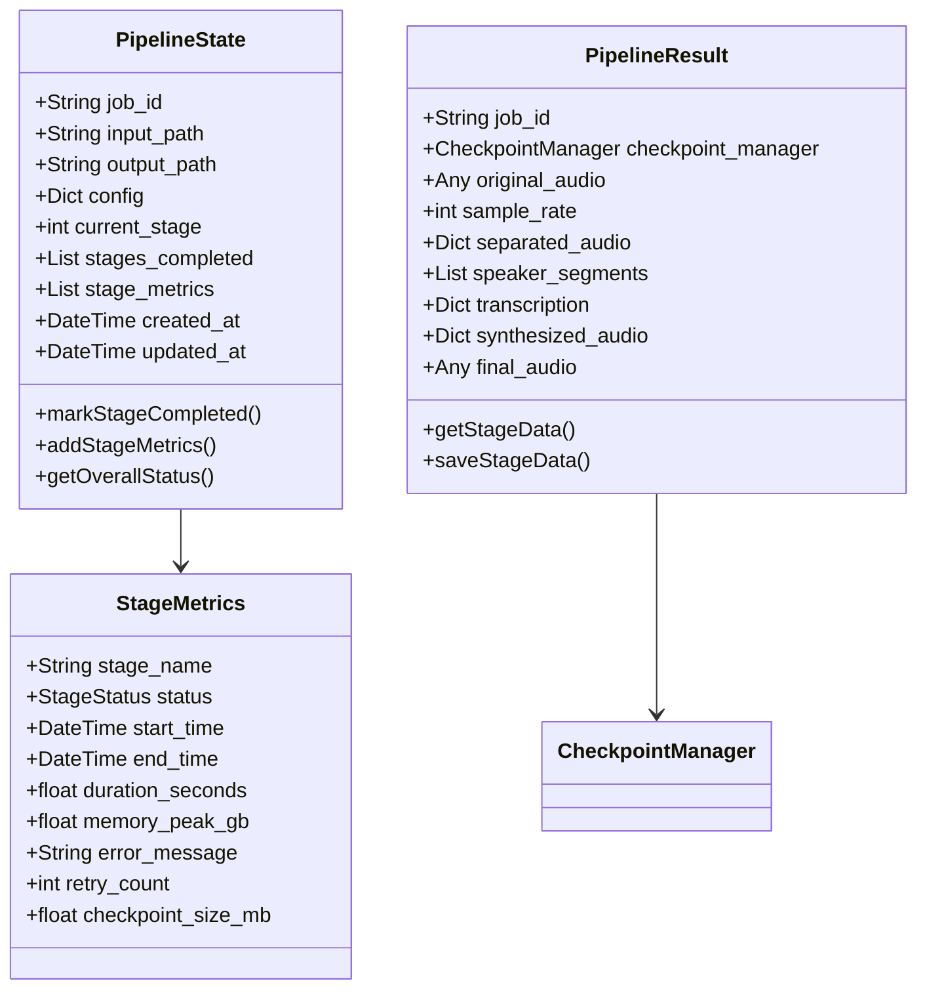
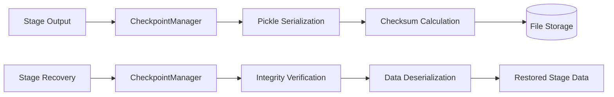
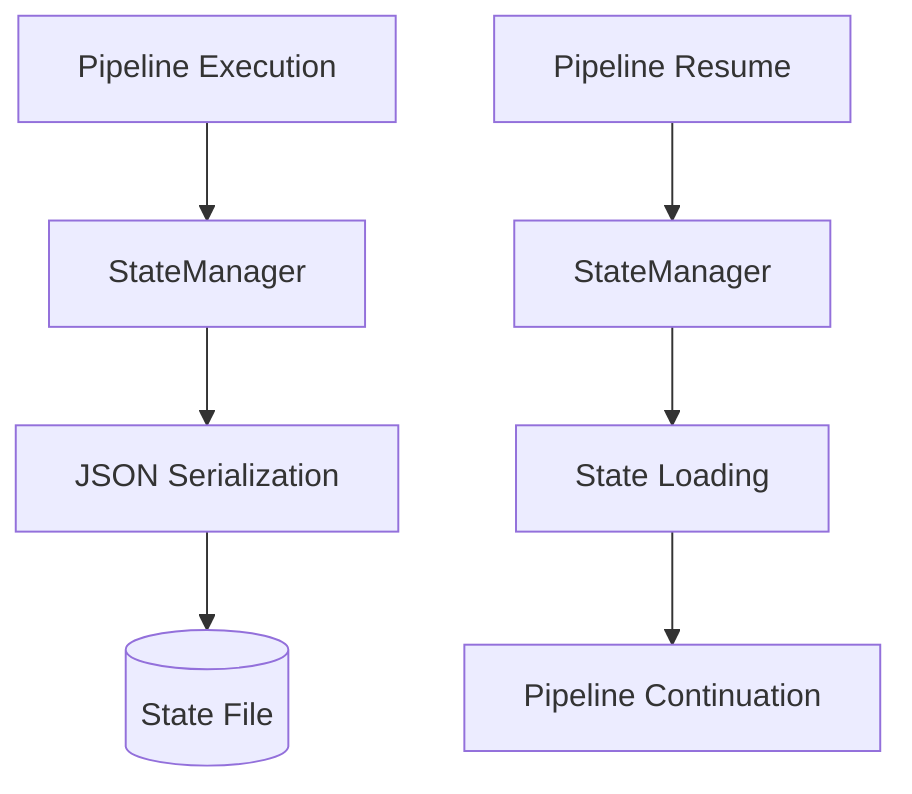
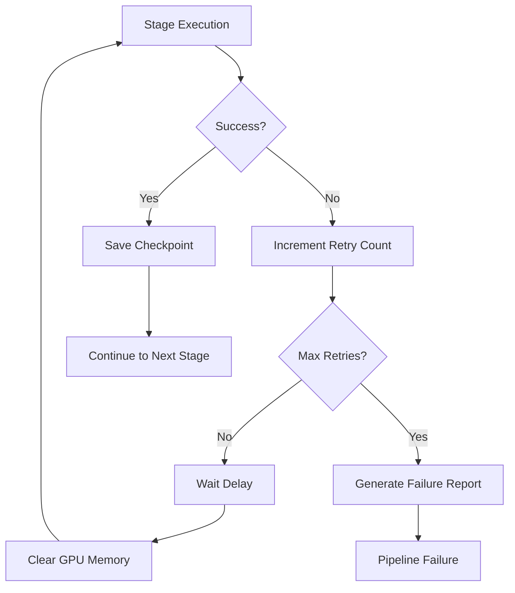
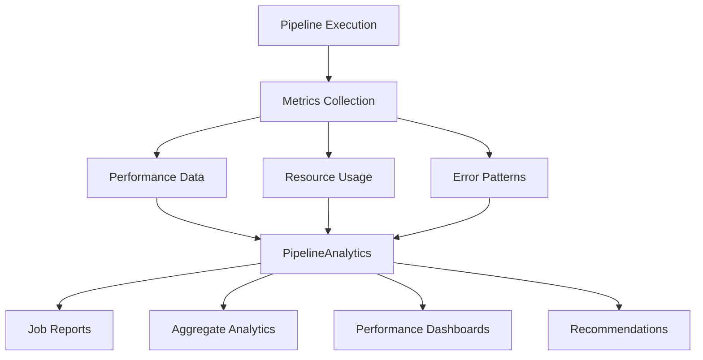

# Hyper-Audio Pipeline Architecture

## Overview

The Hyper-Audio project implements a **resilient and configurable audio processing pipeline** designed for voice replacement in audio files. The system features a modular, stage-based architecture with comprehensive checkpointing, failure recovery, performance monitoring, and a powerful configuration management system that supports complex multi-stage audio processing workflows.

## High-Level Architecture



## Enhanced Pipeline Architecture

### Configurable Pipeline Flow

The enhanced pipeline supports flexible, configurable workflows beyond the traditional linear sequence. It allows for complex processing chains with multiple branches and specialized stages:



### Traditional Linear Pipeline (Original)

For comparison, the original linear pipeline flow:



## Enhanced Stage Interface System

### Type-Safe Stage Architecture with Verification

The enhanced pipeline introduces a sophisticated stage interface system with compile-time type safety, automatic compatibility checking, and comprehensive output verification:



### Configuration Management System



## Stage Specifications

### 1. Audio Preprocessor
**Purpose**: Audio preprocessing and normalization
- **Input**: Raw audio file path
- **Output**: Normalized audio data + sample rate
- **Functionality**: 
  - Audio format standardization
  - Noise reduction
  - Volume normalization
  - Sample rate conversion

### 2. Enhanced Voice Separator
**Purpose**: Voice/music separation using advanced source separation models with quality verification
- **Input**: Normalized audio + sample rate (DataType.AUDIO_WITH_SR)
- **Output**: Multiple separation outputs
  - `vocals`: Separated vocal audio (DataType.AUDIO_MONO)
  - `music`: Separated music/instrumental audio (DataType.AUDIO_MONO)
  - `separated_audio`: Dictionary with vocals and music keys (DataType.SEPARATED_AUDIO)
- **Model**: HTDemucs Fine-tuned (`htdemucs_ft`) - improved quality over standard HTDemucs
- **Enhanced Functionality**:
  - High-quality vocal isolation from background music with automated quality assessment
  - Support for both mono and stereo audio with automatic format conversion
  - Comprehensive output verification including energy level analysis
  - Real-time separation quality metrics (spectral centroid, correlation analysis)
  - GPU-accelerated processing with CUDA support and memory management
  - Automatic detection of separation artifacts and clipping
  - Validation of sample rate requirements (44.1kHz enforcement)

### 3. Speech Enhancer
**Purpose**: Noise reduction and speech quality enhancement with configurable processing levels
- **Input**: Audio with sample rate or separated audio (DataType.AUDIO_WITH_SR)
- **Output**: 
  - `enhanced_audio`: Noise-reduced audio (DataType.AUDIO_MONO)
  - `noise_estimate`: Estimated noise component (DataType.AUDIO_MONO)
- **Model**: SpeechBrain SepFormer (`speechbrain/sepformer-whamr`)
- **Enhanced Functionality**:
  - Advanced noise reduction for speech clarity with quality verification
  - Flexible input handling (direct audio or post-separation processing)
  - Configurable enhancement levels (moderate, aggressive) with performance tracking
  - Seamless integration as post-processing after music separation
  - Automatic input type detection and processing
  - Stage-specific verification for enhancement quality metrics

### 4. Speaker Diarizer
**Purpose**: Speaker identification and segmentation
- **Input**: Enhanced vocal tracks + sample rate (DataType.AUDIO_WITH_SR)
- **Output**: Speaker segments with timestamps and IDs (DataType.SPEAKER_SEGMENTS)
- **Model**: Pyannote speaker-diarization (implemented in `transcribe.py`)
- **Functionality**:
  - Identify different speakers in audio
  - Generate time-based speaker segments
  - Assign unique speaker IDs
  - Configurable min/max speaker counts

### 5. Speech Recognizer
**Purpose**: Speech-to-text transcription with speaker attribution
- **Input**: 
  - Enhanced vocal tracks (DataType.AUDIO_WITH_SR)
  - Speaker segments (DataType.SPEAKER_SEGMENTS)
- **Output**: Transcription with speaker-specific text (DataType.TRANSCRIPTION)
- **Model**: Whisper large-v2 (implemented in `transcribe.py`)
- **Functionality**:
  - Convert speech to text with precise timing
  - Maintain speaker attribution from diarization
  - Support automatic language detection
  - High-accuracy transcription with confidence scores

### 6. Voice Synthesizer
**Purpose**: Voice synthesis and replacement
- **Input**: 
  - Transcription data (DataType.TRANSCRIPTION)
  - Target speaker configuration
  - Replacement voice reference
- **Output**: Synthesized audio for target speaker (DataType.SYNTHESIZED_AUDIO)
- **Model**: MetaVoice-1B (implemented in `tts.py`)
- **Functionality**:
  - Generate speech from text with voice cloning
  - Apply voice style transfer to match reference
  - Preserve natural prosody and timing
  - Support for multiple voice targets

### 7. Audio Reconstructor
**Purpose**: Final audio reconstruction and mixing
- **Input**: 
  - Original separated audio tracks
  - Synthesized replacement audio
  - Speaker segments and timing data
- **Output**: Final reconstructed audio with voice replacement
- **Functionality**:
  - Seamlessly replace target speaker segments
  - Mix synthesized speech with background music
  - Maintain precise timing and synchronization
  - Apply audio mastering and quality enhancement

## Data Models

### Pipeline State Model


## Infrastructure Components

### Checkpoint Management


**Features**:
- Automatic data serialization using pickle
- SHA256 checksum verification for data integrity
- Lazy loading of checkpoint data
- Automatic cleanup capabilities

### State Management


**Features**:
- JSON-based state persistence
- Resume capability from any stage
- Metadata tracking (timestamps, progress, errors)
- Configuration preservation

### Retry and Error Handling


**Configuration**:
- Default max retries: 3
- Default retry delay: 5 seconds
- GPU memory cleanup between retries
- Detailed failure reporting

### Analytics and Monitoring


**Capabilities**:
- Real-time job status tracking
- Performance metrics (duration, memory usage)
- Failure pattern analysis
- Automated recommendations
- Visual performance dashboards

## Key Features

### Resilience
- **Checkpointing**: Automatic stage-by-stage data persistence with integrity verification
- **Resume Capability**: Continue from any failed stage with state restoration
- **Retry Logic**: Configurable retry attempts with exponential backoff and GPU cleanup
- **Error Recovery**: Detailed failure analysis and reporting with diagnostic messages
- **Output Verification**: Comprehensive validation of stage outputs with quality metrics

### Performance
- **GPU Memory Management**: Automatic cleanup and optimization between stages
- **Lazy Loading**: Checkpoint data loaded only when needed
- **Resource Monitoring**: Real-time memory and performance tracking
- **Bottleneck Identification**: Automated performance analysis with stage-specific metrics
- **Quality Assurance**: Real-time audio quality assessment and artifact detection

### Scalability
- **Modular Design**: Independent, replaceable stages with typed interfaces
- **Configuration Management**: Flexible pipeline configuration with dependency validation
- **Job Management**: Multiple concurrent pipeline jobs with state isolation
- **Analytics**: Comprehensive performance monitoring with quality metrics
- **Type Safety**: Compile-time validation prevents runtime connection errors

## Configuration System

### Multi-Stage Pipeline Configuration

The enhanced pipeline supports complex configurations through YAML/JSON files. Example multi-stage speech enhancement configuration:

```yaml
name: "Multi-Stage Speech Enhancement"
description: "Combines music separation and speech enhancement for optimal results"

global_config:
  device: "cuda"
  cache_dir: "~/.cache/hyper_audio"
  max_workers: 4

stages:
  - stage_class: "AudioPreprocessor"
    stage_id: "preprocessor"
    enabled: true
    config:
      target_sample_rate: 44100
      normalize: true
      
  - stage_class: "VoiceSeparator"
    stage_id: "music_separator"
    enabled: true
    config:
      model_name: "htdemucs_ft"
      overlap: 0.75
      
  - stage_class: "SpeechEnhancer"
    stage_id: "noise_reducer"
    enabled: true
    config:
      model_name: "speechbrain/sepformer-whamr"
      enhancement_level: "aggressive"

connections:
  - from_stage: "preprocessor"
    from_output: "audio_with_sr"
    to_stage: "music_separator"
    to_input: "audio_input"
    
  - from_stage: "music_separator"
    from_output: "vocals"
    to_stage: "noise_reducer"
    to_input: "audio_input"
```

### Key Configuration Features

1. **Dependency Validation**: Automatic checking of stage input/output compatibility with detailed error reporting
2. **Execution Ordering**: Topological sort for optimal stage execution sequence
3. **Type Safety**: Compile-time validation of data type connections with comprehensive verification
4. **Flexible Branching**: Support for parallel processing paths and multi-stage workflows
5. **Dynamic Stage Registry**: Runtime registration of available stages with metadata discovery
6. **Output Verification**: Automated quality assurance with stage-specific validation rules
7. **Performance Tracking**: Real-time monitoring of processing quality and resource usage

## Current Implementation Status

### ✅ Implemented Components
- **Pipeline Infrastructure**: Complete core pipeline with retry logic
- **Checkpoint System**: Full checkpointing and state management
- **Analytics Engine**: Comprehensive monitoring and reporting
- **Enhanced Configuration**: Type-safe pipeline configuration with dependency validation
- **Stage Interface System**: Strongly-typed stage inputs/outputs with compatibility checking
- **Multi-Stage Processing**: Support for complex processing chains (music separation + speech enhancement)
- **Development Playground**: Complete development environment for individual stage testing

### ✅ Enhanced Stage Implementations
- **Enhanced Voice Separator**: HTDemucs integration with comprehensive quality verification, spectral analysis, and separation metrics
- **Speech Enhancer**: SpeechBrain SepFormer integration with configurable enhancement levels and flexible input handling
- **Audio Preprocessor**: Complete preprocessing with normalization, resampling, and quality validation
- **Configuration Manager**: Complete system for pipeline configuration and validation
- **Model Loading Utilities**: Reusable model loading with progress feedback
- **Stage Interface System**: Type-safe interface with comprehensive output verification and quality metrics

### ⚠️ Partially Implemented
- **Stage Integration**: Some stage interfaces defined but full implementations pending
- **Standalone Scripts**: Individual processing scripts exist but need enhanced pipeline integration
  - `transcribe.py`: Diarization + Recognition functionality
  - `tts.py`: Voice synthesis using MetaVoice-1B

### 🔄 Integration Opportunities
- **Speaker Diarizer**: Integrate `transcribe.py` diarization → Enhanced SpeakerDiarizer
- **Speech Recognizer**: Integrate `transcribe.py` transcription → Enhanced SpeechRecognizer
- **Voice Synthesizer**: Integrate `tts.py` → Enhanced VoiceSynthesizer
- **Audio Reconstructor**: Implement final stage with enhanced interface

## File Structure

```
src/hyper_audio/pipeline/
├── __init__.py                    # Main exports
├── core.py                        # ResilientAudioPipeline (main orchestrator)
├── models.py                      # Data models (PipelineState, StageMetrics, etc.)
├── constants.py                   # Configuration constants and enums
├── checkpoint.py                  # CheckpointManager and StateManager
├── core_helpers.py                # Utility functions for pipeline operations
├── analytics.py                   # Full analytics with visualizations
├── analytics_simple.py            # Simplified analytics for monitoring
├── stage_interface.py             # Enhanced stage interface and type system
├── config_manager.py              # Configuration management and validation
└── stages/
    ├── __init__.py                # Stage exports
    ├── base.py                    # Base stage interfaces
    ├── preprocessor.py            # Audio preprocessing stage
    ├── enhanced_separator.py      # Enhanced voice separator + speech enhancer
    ├── diarizer.py                # Speaker diarization stage  
    ├── recognizer.py              # Speech recognition stage
    ├── synthesizer.py             # Voice synthesis stage
    └── reconstructor.py           # Audio reconstruction stage

utils/
├── model_loader.py                # Reusable model loading utilities
├── audio_utils.py                 # Audio processing utilities
└── logging_utils.py               # Logging configuration

examples/
├── multi_stage_config.yaml        # Example multi-stage configuration
└── test_enhanced_pipeline.py      # Configuration system demonstration

dev_playground.py                  # Development environment for stage testing
```

## Enhanced Usage Examples

### Basic Configuration-Based Usage with Verification

```python
from hyper_audio.pipeline.config_manager import ConfigManager
from hyper_audio.pipeline import ResilientAudioPipeline
from hyper_audio.pipeline.stages import AudioPreprocessor, EnhancedVoiceSeparator, SpeechEnhancer

# Initialize configuration manager
config_manager = ConfigManager()

# Register available stages
config_manager.register_stage(AudioPreprocessor, "AudioPreprocessor")
config_manager.register_stage(EnhancedVoiceSeparator, "VoiceSeparator") 
config_manager.register_stage(SpeechEnhancer, "SpeechEnhancer")

# Load and validate configuration
pipeline_config = config_manager.load_config("multi_stage_config.yaml")
is_valid, errors = config_manager.validate_config(pipeline_config)

if is_valid:
    # Get optimal execution order
    execution_order = config_manager.get_execution_order(pipeline_config)
    print(f"Execution order: {' → '.join(execution_order)}")
    
    # Initialize and run pipeline with verification
    pipeline = ResilientAudioPipeline(
        config=pipeline_config,
        checkpoint_dir="./checkpoints",
        max_retries=3,
        verify_outputs=True  # Enable comprehensive output verification
    )
    
    result = await pipeline.process_audio_with_config(
        input_path="podcast.wav",
        output_path="enhanced_podcast.wav"
    )
    
    # Access quality metrics and verification results
    for stage_id, metrics in result.stage_metrics.items():
        print(f"Stage {stage_id}: {metrics.verification_status}")
```

### Multi-Stage Speech Enhancement

```python
# Example: Process audio through music separation + speech enhancement
config = {
    "stages": [
        {
            "stage_class": "AudioPreprocessor",
            "stage_id": "preprocessor",
            "config": {"target_sample_rate": 44100}
        },
        {
            "stage_class": "VoiceSeparator", 
            "stage_id": "music_separator",
            "config": {"model_name": "htdemucs_ft"}
        },
        {
            "stage_class": "SpeechEnhancer",
            "stage_id": "noise_reducer", 
            "config": {"enhancement_level": "aggressive"}
        }
    ],
    "connections": [
        {"from_stage": "preprocessor", "from_output": "audio_with_sr", 
         "to_stage": "music_separator", "to_input": "audio_input"},
        {"from_stage": "music_separator", "from_output": "vocals",
         "to_stage": "noise_reducer", "to_input": "audio_input"}
    ]
}

pipeline = ResilientAudioPipeline(config=config)
result = await pipeline.process_audio("input.wav", "output.wav")
```

### Stage Compatibility Checking with Verification

```python
# Verify stage compatibility before configuration
voice_separator = EnhancedVoiceSeparator("separator")
speech_enhancer = SpeechEnhancer("enhancer")

# Check compatibility
connections = voice_separator.can_connect_to(speech_enhancer)
if connections:
    print("Compatible connections:")
    for output, compatible_inputs in connections.items():
        print(f"  {output} → {compatible_inputs}")
        
# Inspect stage metadata
print(f"Voice Separator outputs: {voice_separator.get_output_names()}")
print(f"Speech Enhancer inputs: {speech_enhancer.get_required_inputs()}")

# Test output verification
mock_outputs = {
    "vocals": np.random.randn(44100),  # 1 second of audio
    "music": np.random.randn(44100),
    "separated_audio": {"vocals": np.random.randn(44100), "music": np.random.randn(44100)}
}

success, messages = await voice_separator.verify_outputs(mock_outputs)
print(f"Verification: {success}")
for msg in messages:
    print(f"  {msg}")
```

### Development and Testing

```python
# Use development playground for individual stage testing
from dev_playground import DevPlayground

playground = DevPlayground()

# Test voice separation independently
result = playground.run_stage(
    stage="separator",
    input_data="preprocessor_12345678.pkl",
    profile=True
)

# Inspect results
playground.inspect_result("separator_12345678.pkl")
```

## Key Architectural Benefits

1. **Type Safety**: Compile-time validation prevents incompatible stage connections with comprehensive error reporting
2. **Quality Assurance**: Automated output verification with stage-specific quality metrics and diagnostic feedback
3. **Flexible Configuration**: YAML/JSON-based pipeline definitions support complex workflows with dependency validation
4. **Performance Optimization**: Multi-stage processing with real-time quality assessment and resource monitoring
5. **Development Efficiency**: Playground environment with comprehensive verification tools for rapid iteration
6. **Production Ready**: Enterprise-grade reliability with checkpointing, recovery, monitoring, and quality validation
7. **Comprehensive Verification**: Multi-level validation from data type checking to audio quality assessment
8. **Diagnostic Excellence**: Detailed error messages and quality metrics for troubleshooting and optimization

This enhanced architecture provides a robust foundation for production-scale audio processing with configurable workflows, comprehensive quality assurance, type safety, and advanced diagnostic capabilities. The new verification system ensures high-quality outputs at every stage while providing detailed feedback for optimization and troubleshooting.