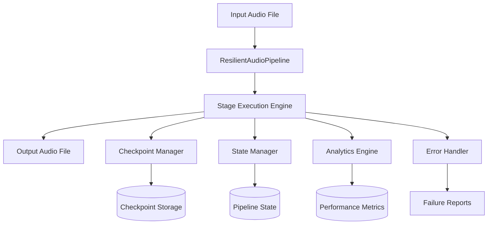
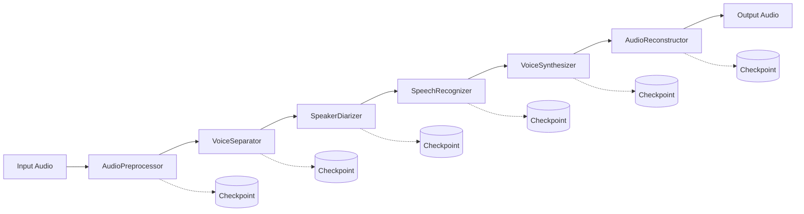
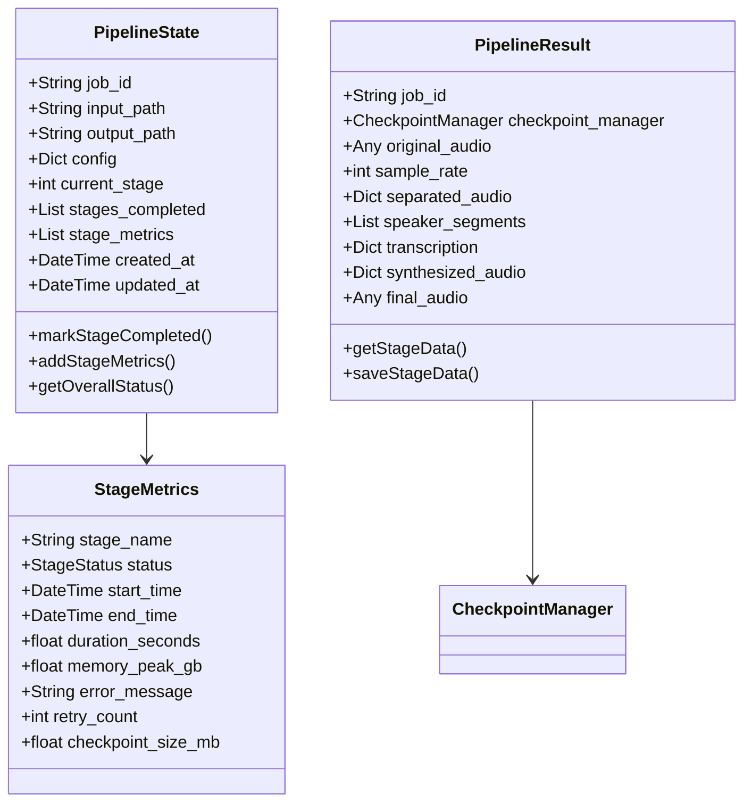
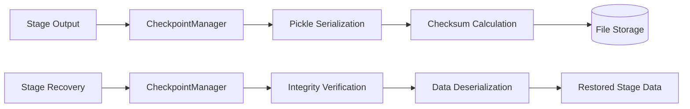
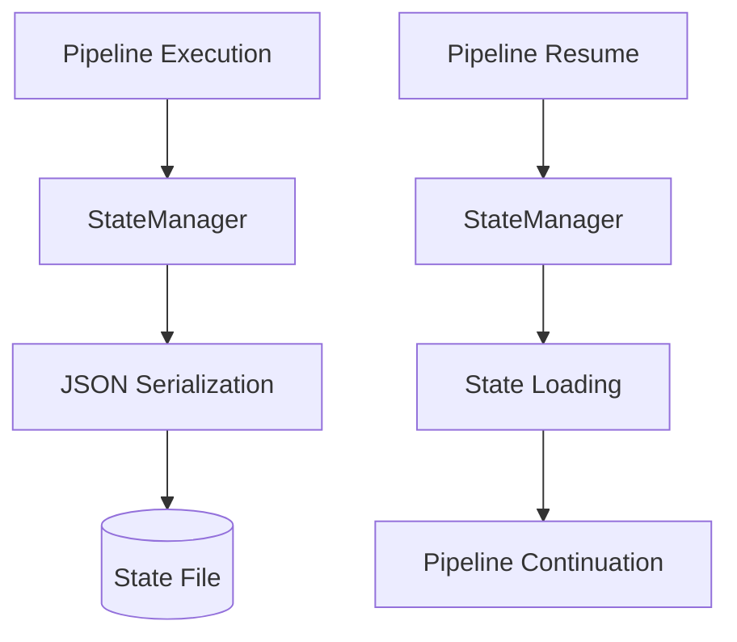
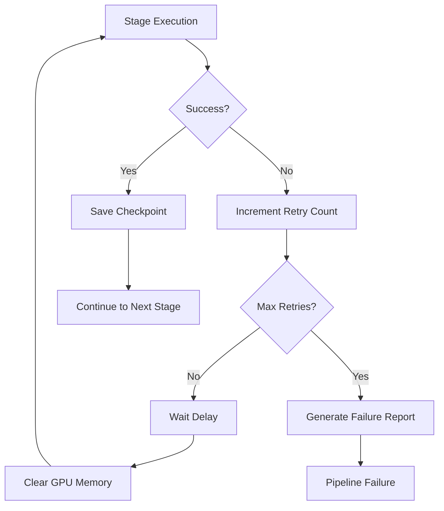
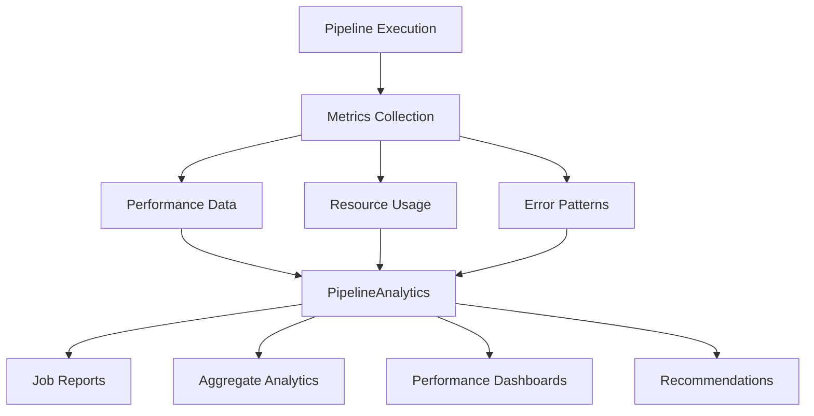

# Hyper-Audio Pipeline Architecture

## Overview

The Hyper-Audio project implements a **resilient audio processing pipeline** designed for voice replacement in audio files. The system uses a modular, stage-based architecture with comprehensive checkpointing, failure recovery, and performance monitoring capabilities.

## High-Level Architecture



## Pipeline Flow

The audio processing pipeline consists of 6 sequential stages, each with its own purpose and data transformations:



## Stage Specifications

### 1. Audio Preprocessor
**Purpose**: Audio preprocessing and normalization
- **Input**: Raw audio file path
- **Output**: Normalized audio data + sample rate
- **Functionality**: 
  - Audio format standardization
  - Noise reduction
  - Volume normalization
  - Sample rate conversion

### 2. Voice Separator
**Purpose**: Voice/music separation using source separation models
- **Input**: Normalized audio + sample rate
- **Output**: Separated audio tracks (vocals, background music)
- **Model**: HTDemucs (implemented in `remove_music.py`)
- **Functionality**:
  - Isolate vocal tracks from background music
  - Preserve audio quality during separation

### 3. Speaker Diarizer
**Purpose**: Speaker identification and segmentation
- **Input**: Vocal tracks + sample rate
- **Output**: Speaker segments with timestamps and IDs
- **Model**: Pyannote speaker-diarization (implemented in `transcribe.py`)
- **Functionality**:
  - Identify different speakers in audio
  - Generate time-based speaker segments
  - Assign unique speaker IDs

### 4. Speech Recognizer
**Purpose**: Speech-to-text transcription with speaker attribution
- **Input**: Vocal tracks + sample rate + speaker segments
- **Output**: Transcription with speaker-specific text
- **Model**: Whisper large-v2 (implemented in `transcribe.py`)
- **Functionality**:
  - Convert speech to text
  - Maintain speaker attribution
  - Handle multiple languages

### 5. Voice Synthesizer
**Purpose**: Voice synthesis and replacement
- **Input**: Transcription + target speaker + replacement voice
- **Output**: Synthesized audio for target speaker
- **Model**: MetaVoice-1B (implemented in `tts.py`)
- **Functionality**:
  - Generate speech from text
  - Apply voice cloning/style transfer
  - Maintain natural prosody

### 6. Audio Reconstructor
**Purpose**: Final audio reconstruction and mixing
- **Input**: Original audio + separated tracks + synthesized audio + speaker segments
- **Output**: Final reconstructed audio with voice replacement
- **Functionality**:
  - Replace target speaker audio
  - Mix synthesized speech with background
  - Maintain timing and synchronization

## Data Models

### Pipeline State Model


## Infrastructure Components

### Checkpoint Management


**Features**:
- Automatic data serialization using pickle
- SHA256 checksum verification for data integrity
- Lazy loading of checkpoint data
- Automatic cleanup capabilities

### State Management


**Features**:
- JSON-based state persistence
- Resume capability from any stage
- Metadata tracking (timestamps, progress, errors)
- Configuration preservation

### Retry and Error Handling


**Configuration**:
- Default max retries: 3
- Default retry delay: 5 seconds
- GPU memory cleanup between retries
- Detailed failure reporting

### Analytics and Monitoring


**Capabilities**:
- Real-time job status tracking
- Performance metrics (duration, memory usage)
- Failure pattern analysis
- Automated recommendations
- Visual performance dashboards

## Key Features

### Resilience
- **Checkpointing**: Automatic stage-by-stage data persistence
- **Resume Capability**: Continue from any failed stage
- **Retry Logic**: Configurable retry attempts with exponential backoff
- **Error Recovery**: Detailed failure analysis and reporting

### Performance
- **GPU Memory Management**: Automatic cleanup and optimization
- **Lazy Loading**: Checkpoint data loaded only when needed
- **Resource Monitoring**: Real-time memory and performance tracking
- **Bottleneck Identification**: Automated performance analysis

### Scalability
- **Modular Design**: Independent, replaceable stages
- **Configuration Management**: Flexible pipeline configuration
- **Job Management**: Multiple concurrent pipeline jobs
- **Analytics**: Comprehensive performance monitoring

## Current Implementation Status

### ✅ Implemented Components
- **Pipeline Infrastructure**: Complete core pipeline with retry logic
- **Checkpoint System**: Full checkpointing and state management
- **Analytics Engine**: Comprehensive monitoring and reporting
- **Configuration**: Flexible pipeline configuration system

### ⚠️ Partially Implemented
- **Stage Definitions**: Stage interfaces defined but implementations missing
- **Standalone Scripts**: Individual processing scripts exist but not integrated
  - `transcribe.py`: Diarization + Recognition functionality
  - `remove_music.py`: Voice separation using HTDemucs
  - `tts.py`: Voice synthesis using MetaVoice-1B

### ❌ Missing Components
- **Stage Implementations**: All 6 pipeline stages need implementation
- **Base Stage Class**: `BasePipelineStage` interface
- **Integration Layer**: Connection between standalone scripts and pipeline
- **Data Serialization**: Stage-specific data formats

## File Structure

```
src/hyper_audio/pipeline/
├── __init__.py              # Main exports
├── core.py                  # ResilientAudioPipeline (main orchestrator)
├── models.py                # Data models (PipelineState, StageMetrics, etc.)
├── constants.py             # Configuration constants and enums
├── checkpoint.py            # CheckpointManager and StateManager
├── core_helpers.py          # Utility functions for pipeline operations
├── analytics.py             # Full analytics with visualizations
├── analytics_simple.py      # Simplified analytics for monitoring
└── stages/
    └── __init__.py          # Stage exports (implementations missing)
```

## Integration Opportunities

The existing standalone scripts provide the foundation for pipeline stage implementations:

1. **Audio Preprocessing**: Needs implementation
2. **Voice Separation**: Integrate `remove_music.py` → VoiceSeparator
3. **Speaker Diarization**: Integrate `transcribe.py` diarization → SpeakerDiarizer  
4. **Speech Recognition**: Integrate `transcribe.py` transcription → SpeechRecognizer
5. **Voice Synthesis**: Integrate `tts.py` → VoiceSynthesizer
6. **Audio Reconstruction**: Needs implementation

## Usage Example

```python
from hyper_audio.pipeline import ResilientAudioPipeline

# Initialize pipeline
pipeline = ResilientAudioPipeline(
    checkpoint_dir="./checkpoints",
    max_retries=3
)

# Process audio with voice replacement
result = await pipeline.process_audio(
    input_path="input.wav",
    output_path="output.wav",
    target_speaker="SPEAKER_01",
    replacement_voice="reference_voice.wav",
    resume_from_checkpoint=True
)

# Monitor progress
status = pipeline.get_job_status(result.job_id)
print(f"Progress: {status['progress_percentage']}%")
```

This architecture provides a robust foundation for production-scale audio processing with enterprise-grade reliability, monitoring, and scalability features.